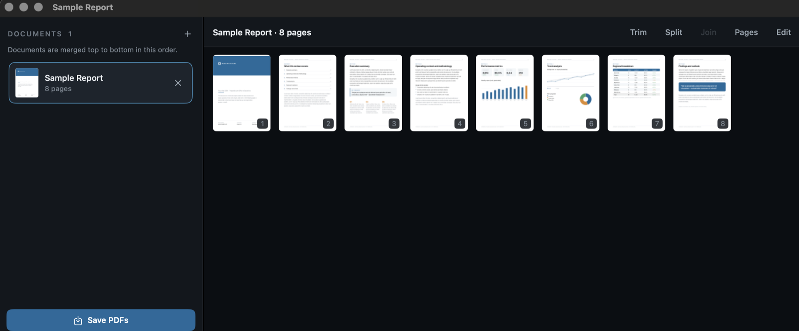
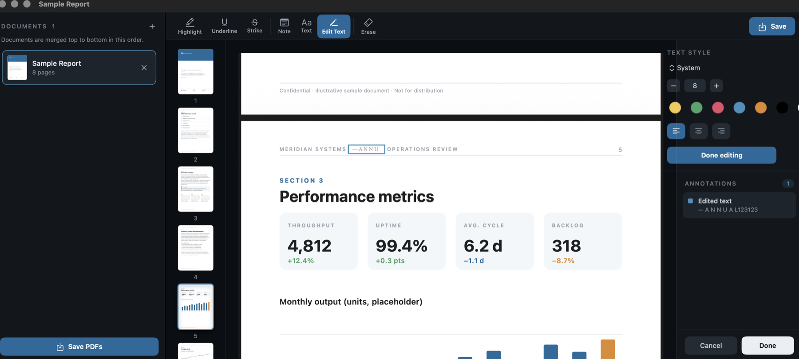

# PDF Stack

A native macOS app for combining, splitting, trimming, and marking up PDFs. Drop
in one or more PDFs, reorder and edit them, then save — either as a single merged
document or as separate files.

Built with SwiftUI and PDFKit, no third-party dependencies. Requires macOS 13
(Ventura) or later.


*The document workspace — select pages, then trim, split, join, or edit them.*


*Editing text directly on the page, with font, size, colour, and alignment in the inspector.*

## Features

- **Combine** multiple PDFs into one, in an order you control by dragging rows in
  the sidebar.
- **Trim** a document down to a page range.
- **Split** a document into multiple pieces at the page boundaries you choose,
  either feeding the pieces back into the list or exporting them immediately.
- **Page tools** — rotate, delete, extract, and join selected pages.
- **Markup** — highlight, underline, and strikethrough existing text in a chosen
  color and opacity; drop notes; erase annotations.
- **On-page text editing** — add new text or edit existing text blocks directly
  on the page (not in a popup), with controls for font, size, color, and
  alignment.
- **Drag and drop** PDFs anywhere in the window, or click to browse.

## Building

The project is a Swift Package. To build and run from source:

```sh
swift run PDFStack
```

To produce a distributable `.app` bundle:

```sh
./scripts/build-app.sh
open "dist/PDF Stack.app"
```

The app icon is generated separately with `./scripts/make-icon.sh`, and
`./scripts/build-dmg.sh` packages a `.dmg` for distribution.

## Tests

A smoke-test target exercises the core PDF operations (trim, split, merge,
annotation, and text-block detection):

```sh
swift run PDFStackSmokeTests
```

It prints `ALL CHECKS PASSED` on success and exits non-zero on failure.

## Project layout

- `Sources/PDFStackKit` — the PDF engine: import, merge/trim/split, page
  operations, annotation and text-block operations. No UI dependencies.
- `Sources/PDFStack` — the SwiftUI app: window layout, sidebar, page grid, and
  the markup workspace.
- `Sources/PDFStackSmokeTests` — an executable that verifies `PDFStackKit`.

## License

MIT — see [LICENSE](LICENSE).
